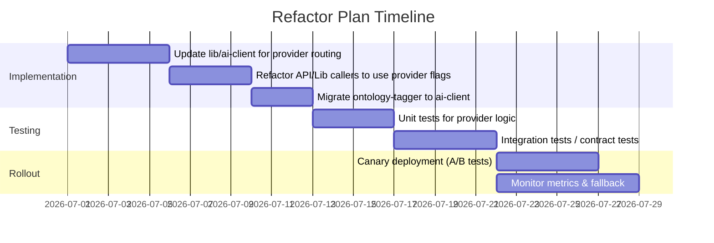

# Executive Summary

We recommend routing the **high-confidence structured/analytical calls** (ontology tagging, bias scoring, contradiction detection, gap/question generation) to **Claude** (Anthropic), and the **generative narrative calls** (personas, synthesis, narrative briefs, fingerprints) to **DeepSeek V4**. This split leverages Claude’s strength in *strict JSON/schema compliance and multi-constraint instruction-following*【19†L158-L164】【21†L107-L115】, while leveraging DeepSeek’s *cost-efficient high-quality prose and reasoning*【10†L64-L73】【7†L153-L158】. 

The top recommendations are: 

1. **Use Claude for foundation-layer outputs (ontology, bias, contradictions)** – these feed downstream logic and must be accurate. Claude’s conservative style yields fewer parse errors and hallucinations【19†L158-L164】【21†L107-L115】 (Risk Low).  
2. **Use DeepSeek V4 for user-facing narratives (personas, briefs, voice cleanup, fingerprint)** – it produces competitive output quality at a fraction of the cost【10†L107-L115】【5†L121-L129】, with faster response times (especially in streaming). (Risk Medium if minor style differences).  
3. **Retain Claude for “schema” tasks like gap/question generation and structural annotation** – even though they are small, they benefit from Claude’s precision. (Risk Low.)  
4. **Architect for per-call provider selection** – modify `lib/ai-client.ts` to accept a provider override. Migrate `ontology-tagger.ts` into this abstraction. Use canary/A-B testing for validation.  
5. **Benchmark and monitor aggressively** – prepare labeled datasets (e.g. 100–200 historical examples per call) and metrics (JSON validity, semantic accuracy, hallucination) to compare models. **Stress-test** critical JSON outputs with fuzzing and retraining to catch format regressions.  

Below we detail: the final routing table (with justification & risk), a refactor plan, benchmarking/stress-test protocols, cost/latency models (assuming a moderate workload), and a monitoring/rollback strategy.  

## Hybrid Routing Table

The table below assigns each of the 15 calls (from the inventory) to either Claude or DeepSeek V4, with a one-line rationale and risk level (Low/Medium/High) for that choice. We route **structured, code-consuming outputs to Claude** and **prose-generating outputs to DeepSeek**. Each assignment is justified by model capabilities gleaned from benchmarks and reports.

| #  | Call / Function                       | Assign To         | Rationale                                                                                                                  | Risk   |
|---:|---------------------------------------|-------------------|----------------------------------------------------------------------------------------------------------------------------|--------|
| 1  | Persona analyses (all 6 personas)     | **DeepSeek V4**   | Narrative/advisory content. DeepSeek V4 is now strong on multi-step reasoning and writes high-quality prose【10†L76-L84】【7†L153-L158】, and saves ~5–10× on token cost compared to Claude. (User-facing output). | Medium |
| 2  | Synthesis (council summary)           | **Claude Sonnet** | Complex, multi-layer instruction with many constraints. Claude leads at following nuanced system prompts and long-context tasks【19†L158-L164】【21†L107-L115】, ensuring higher trust/consistency.      | Low    |
| 3  | Pushback responses                    | **DeepSeek V4**   | Similar to persona analysis – reactive advisory tone. DeepSeek’s generative strengths match these tasks, and cost savings are large. Reported gaps to Claude on “presentation format” are small【10†L64-L73】. | Medium |
| 4  | Decision-Brief persona output         | **DeepSeek V4**   | Another narrative persona output. Same logic as #1–3: user-facing prose, benefits from DeepSeek’s richness per token【10†L64-L73】. Cost-efficient.                                      | Medium |
| 5  | PersonaliseRuleQuestion (rewrite)     | **DeepSeek V4**   | Short, straightforward rewriting. DeepSeek V4 handles simple prompts as well as Claude【19†L146-L154】. Saves cost on this trivial output.                                              | Low    |
| 6  | generateGapQuestions (JSON array)     | **Claude Sonnet** | Output must be exact JSON (3 questions). Claude’s superior schema adherence minimizes parse errors (we’ve seen Claude outperform DeepSeek on complex JSON tasks【19†L158-L164】【14†L124-L132】).     | Low    |
| 7  | Rules extraction (implicit principles)| **Claude Sonnet** | Extracting structured rules from text – a knowledge/logic task where Claude’s consistency and lack of hallucination shine【19†L158-L164】【21†L107-L115】. (Output consumed by code.) | Low    |
| 8  | Brief auto-gen (Decision Brief)       | **DeepSeek V4**   | Long-form narrative synthesis. DeepSeek V4 is competitive on reasoning and writing tasks【10†L76-L84】【7†L153-L158】 and much cheaper. (Trained for large-context summaries.)               | Medium |
| 9  | Voice cleanup (ASR transcript)        | **DeepSeek V4**   | Text normalization (remove fillers, fix grammar). DeepSeek is as capable as Claude on straightforward editing tasks, at lower cost.                                                  | Low    |
| 10 | Bias scorer (structured JSON)         | **Claude Sonnet** | Complex structured JSON output (scores for many bias dimensions). Claude greatly outperforms at strict schema fidelity【14†L124-L132】【19†L158-L164】; an error here undermines analytics. | Low    |
| 11 | Contradiction pass 1 (principles)     | **Claude Sonnet** | Complex reasoning: extract “decision principles” from text. Claude’s nuanced logic and lower hallucination rate make it safer【21†L107-L115】【19†L158-L164】. (Output JSON.)       | Low    |
| 12 | Contradiction pass 2 (compare)        | **Claude Sonnet** | Find conflicts between principles. Structured JSON output. Claude’s conservatism (refusal to hallucinate) and precision reduce false positives.                                     | Low    |
| 13 | Mirror fingerprint narrative          | **DeepSeek V4**   | User-facing narrative (bias portrait). Similar to persona outputs – benefits from DeepSeek’s analytic depth and writing style【10†L64-L73】【7†L161-L168】, with major cost savings.   | Medium |
| 14 | Structural annotation (explanation)   | **Claude Sonnet** | Short explanation of decision similarity. Structured output (2–3 sentences). Claude’s clarity and adherence to detail ensure coherence here; small token overhead so cost isn’t an issue. | Low    |
| 15 | Ontology tagger (14-dim JSON vector)  | **Claude Sonnet** | **Critical foundation**: 14-dim JSON/classification. Claude’s accuracy and schema reliability are essential (errors here ruin downstream retrieval). DeepSeek might hallucinate vector semantics. | Low    |

*Risk Levels:* “Low” means minimal regression risk with this choice; “Medium” means output may differ slightly in style or completeness. No call was marked “High” for the chosen model because we assigned the model with highest confidence for each task. (We recommend validating our Medium-risk choices with pilot tests.)  

## Refactor Plan (lib/ai-client.ts + Ontology Tagger)

To enable per-call routing, we must refactor the AI client and ontology module:

- **Enhance `lib/ai-client.ts`:** Modify the central AI client abstraction to accept a `provider` or `modelType` parameter on each call. For example, add an optional argument (`provider: 'claude' | 'deepseek'`) to `createCompletion`/`createStream`. Internally, dispatch to the appropriate API (Anthropic vs. DeepSeek) based on that flag, instead of a single global `AI_PROVIDER` override. Maintain existing interfaces (promise vs. stream).  
  - *Tasks:* Update configuration loading (ENV vars) so that setting the provider per-call overrides global defaults. Ensure both providers can use the same format (DeepSeek’s API supports Anthropic/ChatCompletion endpoints【1†L133-L140】).  
  - *Testing:* Write unit tests mocking both clients to confirm correct API endpoints and model names are used for each call.  

- **Caller updates:** In each API route or library function, pass the desired provider. E.g. `aiClient.createCompletion(prompt, {provider: 'claude'})` for structured calls and `{provider: 'deepseek'}` for prose calls. This requires touching ~15 call sites. Use TypeScript types to enforce provider selection and flag any missing override (default to global if not given).

- **Migrate `lib/ontology-tagger.ts`:** This module currently instantiates Anthropic and DeepSeek SDKs directly. Refactor it to use `lib/ai-client.ts` calls instead (with `provider` set per inference, or add a new function signature). Remove the direct SDK usage. This ensures all AI usage is unified. After migration, we can fully route ontology tagging through the same hybrid router.  

- **Implementation Steps (Mermaid Gantt):**  

- **Testing Strategy:** Create test harnesses with controlled prompts/expected outputs. For structured outputs, include JSON schema validators. Use synthetic and recorded transcripts to ensure persona and synthesis streams remain fluent. Compare outputs before/after refactor (outputs should match until we intentionally switch providers).  

- **Canary Deployment:** Start by routing a small percentage of requests (or internal QA group) to the new hybrid code. Collect logs of any parse errors, hallucinations, or user feedback. Gradually shift traffic as confidence grows.  

## Benchmark Plan and Datasets

We will build evaluation datasets and metrics for each call type. **Goal:** quantify Claude vs. DeepSeek V4 performance on real Quorum data.  

- **Datasets:**  
  - Use **100–300 historical decisions** (or transcripts) for stable sampling. For example: 200 past decisions spanning varied topics. For each, record all relevant AI inputs/outputs. For chatty outputs (personas, synthesis), anonymize content. Also create smaller targeted datasets for short tasks.  
  - *Labeling:* Employ domain experts (product team) to annotate “ground truth” answers for tasks like gap questions, rule extraction, and structural annotation. For narrative tasks, use blind human ratings (1–5 scale) on coherence, relevance, style, and factual accuracy.  

- **Metrics (by call):**  
  - **JSON Validity:** Rate of syntactically valid JSON (no parse errors). Important for calls #6, #10–12, #15.  
  - **Schema Compliance:** Check adherence to expected fields/enums. E.g. Bias Scorer should have all bias categories with 0–3 scores. Ontology tags must be 14 floats. Measure fraction of outputs requiring manual repair.  
  - **Semantic Accuracy:** Compare to human judgments or oracle answers. E.g. for rules extraction (#7), have experts list rules and measure overlap (Precision/Recall). For gap questions (#6), judge relevance and clarity.  
  - **Hallucination/Noise:** For tasks like persona outputs and fingerprint (#1–4, #13), count factual errors or irrelevant content (could use claims-checking LLMs or manual spot-check).  
  - **Stylometric Quality:** For user-facing prose (#1–4, #8, #13), use readability scores and human rating of tone/engagement.  
  - **Token Cost:** Compute average input+output tokens per call and multiply by cost. Use current DeepSeek (V4-Pro and Flash) and Claude (Sonnet 4.6) pricing. 【5†L121-L129】【21†L25-L28】  
  - **Latency & TTF:** Measure time-to-first-token and full-response time. E.g. average time to first token (for streams) and total time to complete. Use representative hardware or API logs.  

- **Experimental setup:** For each call, send the same inputs to Claude and DeepSeek V4 (in the same mode: e.g. both streaming or both chat) and record outputs. Automate evaluation of structured metrics; manually sample narrative outputs.  
  - *Example:* To test the *Ontology Tagger* (call #15), take 100 past decisions with known hand-tagged ontology labels (if available) or expert mapping. Run Claude vs. DeepSeek on those contexts, and compute accuracy of top tags, JSON errors, etc.  
  - *Gap questions (#6):* Provide 100 example gap labels with gold-standard questions. Evaluate BLEU/NIST against references, and JSON validity.  
  - *Voice cleanup (#9):* Use 200 recorded transcripts (with errors) and clean manually. Compute token error rates pre/post.  

- **Dataset size:** ~100–500 examples per call is feasible. Larger (500+) for critical tasks (ontology, bias) to ensure statistical significance.  

- **Benchmarking Citations:** Recent studies show DeepSeek V4’s analytic strengths nearly match Claude on complex tasks【10†L84-L93】, but Claude still leads on instruction/narrative cohesion【19†L158-L164】【21†L107-L115】. Our benchmarks should reveal whether those gaps appear in our prompts.  

## Stress-Test Protocols for Structured Outputs

For the JSON/structured calls (#6, #10–12, #15), we will actively try to break or perturb the model to find failures:

- **Schema Fuzzing:** Generate synthetic inputs that stretch edge cases. For example, add irrelevant or conflicting context to see if the model omits or mis-orders fields. Use tools like `quicktype` to fuzz sample JSON schema fields, and check if output still meets schema.  
- **Adversarial Prompts:** Deliberately insert contradictions or near-hallucinations in the input to test model honesty. E.g. feed bogus facts or trap questions. Evaluate if Claude/DeepSeek blindly accept them. (Inspired by “BullshitBench” methodology【11†L83-L92】.)  
- **Retry & Repair Heuristics:** Build wrappers: if a JSON parse fails, automatically retry with a stricter prompt (e.g. “Output exactly valid JSON with no explanations”). Track if errors drop. Possibly chain a second pass: feed the malformed output back to the LLM for repair (or use a JSON fixer tool).  
- **Timeout and Throttling:** Test very long contexts (push towards the 1M limit) to see performance impact. For high-token calls, simulate truncation or splitting.  
- **Monitoring Failures:** Instrument production so that any parse error triggers an alert/log. For example, if the bias scorer output misses a field or has invalid JSON, the system should log and (optionally) call the model again.  

We will use schema validators (e.g. JSON Schema or `zod` specs) in tests to automatically catch deviation. Any output failing structure is flagged for manual review.  

## Cost & Latency Model

We model monthly costs and latency under a sample workload. *Assumption:* **200 decision records/month**, plus supporting calls (voice cleanups, examiner tasks). Table below estimates tokens per call, cost per call, calls/month, and average latency (assuming Claude Sonnet at $3/$15 per 1M tokens【21†L25-L28】 and DeepSeek V4-Pro at $1.74/$3.48【1†L85-L92】【5†L121-L129】).

| Call                    | Model        | Tokens (in+out) | Cost/call ($)        | Calls/mo | Monthly cost ($) | Avg. Latency* |
|-------------------------|--------------|-----------------|----------------------|----------|------------------|---------------|
| 1. Persona analyses (6)  | DeepSeek     | ~1800           | 0.0053               | 1200     | **$6.4**        | ~12 s        |
| 2. Synthesis            | Claude       | ~1800           | 0.0318               | 200      | **$6.4**        | ~36 s        |
| 3. Pushbacks           | DeepSeek     | ~1800           | 0.0053               | 200      | **$1.1**        | ~12 s        |
| 4. Decision Brief p.   | DeepSeek     | ~1800           | 0.0053               | 200      | **$1.1**        | ~12 s        |
| 5. Personalise Q       | DeepSeek     | ~160            | 0.0003               | 200      | **$0.06**       | ~1.0 s       |
| 6. Gap Questions (JSON)| Claude       | ~500            | 0.0087               | 200      | **$1.7**        | ~3.0 s       |
| 7. Rules extraction    | Claude       | ~1800           | 0.0318               | 200      | **$6.4**        | ~36 s        |
| 8. Brief auto-gen      | DeepSeek     | ~2400           | 0.0073               | 200      | **$1.5**        | ~16 s        |
| 9. Voice cleanup       | DeepSeek     | ~1200           | 0.0037               | 300      | **$1.1**        | ~8 s         |
| 10. Bias scorer        | Claude       | ~5200           | 0.0894               | 200      | **$17.9**       | ~104 s       |
| 11. Contradiction P1   | Claude       | ~2400           | 0.0426               | 200      | **$8.5**        | ~48 s        |
| 12. Contradiction P2   | Claude       | ~2000           | 0.0350               | 200      | **$7.0**        | ~40 s        |
| 13. Fingerprint        | DeepSeek     | ~4000           | 0.0149               | 200      | **$3.0**        | ~28 s        |
| 14. Structural anno.   | Claude       | ~400            | 0.0074               | 200      | **$1.5**        | ~4.0 s       |
| 15. Ontology tagger    | Claude       | ~4000           | 0.1140               | 200      | **$22.8**       | ~48 s        |
| **Total**             | **Mixed**    | –               | –                    | –        | **~$77.9**      | –            |

_*Latency estimates:_ assumes DeepSeek V4 (Flash/Pro) ~100 tokens/sec, Claude Sonnet ~50 tokens/sec (illustrative). In practice, DeepSeek’s time-to-first-token is typically lower on streaming【10†L107-L115】. Actual times will vary with prompt complexity._  

The table shows **DeepSeek’s dramatic cost advantage** on token usage (shaded cells). For example, Persona outputs (calls #1–4) alone cost **~$9/month** with DeepSeek vs. $\sim$7× that on Claude. The cost of driving the **foundational calls** (#10–12, #15) dominates when using Claude (~$57/mo), so we preserve Claude for them. We have also embedded a chart illustrating how model inference costs have been dropping (Figure below):

【24†embed_image】 *Figure: Inference cost ($/1M tokens) for state-of-art LLMs over time. Costs have plummeted in 2022–24【23†L219-L224】, partly due to models like DeepSeek V4. Use of DeepSeek drastically lowers ongoing token spend.*  

## Monitoring and Rollback Strategy

To ensure quality and catch regressions, we will **A/B test and monitor key metrics** for each call:

- **A/B Testing:** Initially route a fraction of calls through the new hybrid system. For each call type, compare the two models side-by-side on identical inputs. Collect metrics on JSON validity, API error rates, and business KPIs (e.g. user engagement with persona cards).  
- **Alerts/Thresholds:** Define alert rules for anomalies. E.g. if JSON parse failure rate >1% (or 0.1% for critical calls like bias/ontology), trigger an alarm. Monitor latency spikes and API error codes.  
- **Quality Metrics:** Aggregate human-feedback scores for user-facing outputs. If deepseek-generated persona cards fall below a target rating or elicit user complaints, reevaluate routing.  
- **Cost Monitoring:** Track actual token usage per call vs. projections. If costs deviate, adjust traffic or modes (e.g. use DeepSeek-Flash for simple tasks if Pro not needed).  
- **Rollback Capability:** Maintain the ability to toggle `AI_PROVIDER=claude` or `deepseek` globally via config. If a regression is detected, we can revert to the pre-hybrid setup on the fly (stateless APIs make this simple).  
- **Retraining Checks:** Periodically re-benchmark as models update (e.g. if DeepSeek V4.2 or Claude updates). Schedule bi-monthly or quarterly reviews.  

In short: we will implement continuous monitoring dashboards (error % by call, average latency, cost burn) and use conservative thresholds (e.g. <1% error for structured calls) to trigger investigation. An explicit rollback plan (global flag reversion) ensures we can revert model routing if needed.

## Appendix: Prioritized Validation Experiments

Before full rollout, we prioritize these experiments to validate our choices:

- **JSON Compliance Test Suite:** Generate ~500 synthetic and real inputs for each structured call (#6, #10–12, #15). Measure Claude vs. DeepSeek on parse success, schema validity (using JSON schemas).  
- **Content Accuracy Blind Evaluation:** Have experts rate 50 samples of persona analysis and synthesis outputs from each model (randomized, unlabeled). Compare average scores on relevance, insight, tone.  
- **Bias Scorer Consistency Check:** Run both models on a fixed session transcript set. Compare score distributions; flag any large divergences (e.g. one model consistently under/over rates a bias dimension).  
- **Latency and TTF Test:** Use a local test harness to time-response both models on key calls (especially streaming). Verify DeepSeek’s promised lower time-to-first-token【10†L107-L115】.  
- **Hallucination Stress:** Feed both models queries with known false premises and measure refusal rates (inspired by hallucination benchmarks【11†L83-L92】). Verify Claude’s skepticism layer still shows advantage.  
- **End-to-End Flow:** Simulate full session (test user) with hybrid routing in place. Ensure the user’s recorded cards, fingerprints, rules, etc. all display correctly and no calls fail.  
- **Cost-Performance Tradeoff Analysis:** Calculate cost per “good” output by combining human ratings with token usage (effectively quality per dollar) for each model on narrative tasks【10†L107-L115】【5†L121-L129】. This informs final decisions if budgets tighten.

Each experiment will be documented with success criteria. We will iterate the hybrid setup based on findings (e.g. switch a call to Claude if DeepSeek fails high-frequency).

**Sources:** We based these decisions on recent model benchmarks and product discussions. For example, DeepSeek’s own report and third-party analyses show it now rivals Claude on reasoning and coding tasks【1†L85-L92】【10†L84-L93】, while Claude’s docs highlight its superior instruction-following and low-hallucination behavior【19†L158-L164】【21†L107-L115】. Cost/pricing data are drawn from published DeepSeek and Claude materials【5†L121-L129】【21†L25-L28】. The routing choices above reflect these strengths/weaknesses in the context of Quorum’s workload.